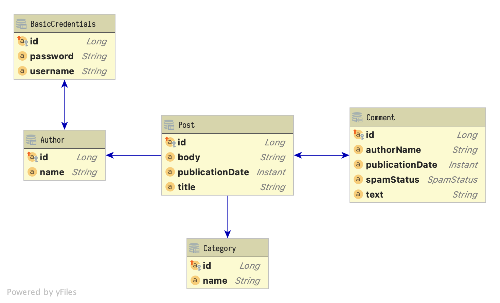

= Highly Efficient Enterprise Data Access
Matthias Andreas Benkard
// Meta
:experimental:
:data-uri:
:toc:
:stem:
:toclevels: 2
:description: Slides for my Hibernate Patterns and Antipatterns talk
:keywords: mulk
// Settings
:icons: font
:revealjs_theme: simple
:revealjs_width: 1280
:revealjs_height: 800
:customcss: SLIDES.css
:source-highlighter: highlightjs
:highlightjs-theme: grayscale.css
:table-stripes: hover
:stem:

[%notitle]
== Setting the Stage

[%notitle]
[.columns]
=== Posts

[source,java,data-lines=]
[.column]
[.is-two-thirds]
----
@Entity
public class Post extends PanacheEntity {

  public String title;
  public Instant publicationDate;
  public String body;

  @ManyToOne(fetch = FetchType.LAZY)         //<1>
  public Author author;

  @ManyToMany(fetch = FetchType.LAZY)        //<2>
  public Collection<Category> categories;

  @OneToMany(fetch = FetchType.LAZY,
             mappedBy = "post")              //<3>
  public Collection<Comment> comments;
}
----

[.column]
<1> lazy is good (can always `JOIN FETCH` later)
<2> `@ManyToMany` always implies a join table
<3> mapping without a join table, non-owning side

[%notitle]
=== Authors, Login Credentials

[source,java]
----
@Entity
public class Author extends PanacheEntity {

  public String name;

  @OneToOne(fetch = FetchType.LAZY,        //<1>
            mappedBy = "author")
  public BasicCredentials basicCredentials;
}
----

[source,java]
----
@Entity
public class BasicCredentials extends PanacheEntity {

  @OneToOne(fetch = FetchType.LAZY)
  @MapsId
  public Author author;

  public String username;
  public String password;
}
----

[%notitle]
//[.columns]
== Cartesian Blowup

[source,java]
----
@Transactional
public List<Post> getAllWithCommentsAndCategories() {

  return Post.find(
      """
      SELECT p FROM Post p
        LEFT JOIN FETCH p.comments
        LEFT JOIN FETCH p.categories
      """)
      .list();
}
----

[%notitle]
=== Bad SQL

[source,sql]
//[.column]
//[.is-two-thirds]
----
select
    post0_.id,
    comments1_.id,
    category3_.id,
    post0_.author_id,
    post0_.body,
    post0_.publication_date,
    post0_.title,
    comments1_.author_name,
    comments1_.post_id,
    comments1_.publication_date,
    comments1_.spam_status,
    comments1_.text,
    comments1_.post_id,
    comments1_.id,
    category3_.name,
    categories2_.post_id,
    categories2_.categories_id
from
    post post0_ 
left outer join
    comment comments1_ 
        on post0_.id=comments1_.post_id 
left outer join
    post_category categories2_ 
        on post0_.id=categories2_.post_id 
left outer join
    category category3_ 
        on categories2_.categories_id=category3_.id;
----

[%notitle]
=== Bad Results (1)

--
[source]
----
[2021-02-27 10:32:58] 60 rows retrieved
----

stem:[60 = ubrace|"posts"|_10 * ubrace|("comments")/("post")|_3 * ubrace|"categories"|_2]

Cartesian explosion! 🙀

What gives?
--

[%notitle]
=== Bad Results (2)

[%header%autofit.supersmall,format=tsv,stripes=hover]
|===
post_id	com_id	cat_id	body	title	comment_author	com_pubdate	spamp	com_text	cat_name
4	16	44	"foo"	Post #0	Anonymous Coward	2021-02-27 10:32:16.133969	HAM	First post	Category #1
4	15	44	"foo"	Post #0	Anonymous Coward	2021-02-27 10:32:16.133963	SPAM	First post!	Category #1
4	14	44	"foo"	Post #0	Anonymous Coward	2021-02-27 10:32:16.133870	UNKNOWN	First post!!	Category #1
4	16	45	"foo"	Post #0	Anonymous Coward	2021-02-27 10:32:16.133969	HAM	First post	Category #0
4	15	45	"foo"	Post #0	Anonymous Coward	2021-02-27 10:32:16.133963	SPAM	First post!	Category #0
4	14	45	"foo"	Post #0	Anonymous Coward	2021-02-27 10:32:16.133870	UNKNOWN	First post!!	Category #0
5	19	44	"bar!"	Post #1	Anonymous Coward	2021-02-27 10:32:16.135200	SPAM	Bah	Category #1
5	18	44	"bar!"	Post #1	Anonymous Coward	2021-02-27 10:32:16.135192	SPAM	OK	Category #1
5	17	44	"bar!"	Post #1	Anonymous Coward	2021-02-27 10:32:16.135205	UNKNOWN	Meh.	Category #1
5	19	45	"bar!"	Post #1	Anonymous Coward	2021-02-27 10:32:16.135200	SPAM	Bah	Category #0
5	18	45	"bar!"	Post #1	Anonymous Coward	2021-02-27 10:32:16.135192	SPAM	OK	Category #0
5	17	45	"bar!"	Post #1	Anonymous Coward	2021-02-27 10:32:16.135205	UNKNOWN	Meh.	Category #0
|===
...

[%notitle]
=== Fix: Sequential Fetch Queries

[source,java,linenums,highlight="|4-9|11-18|15,17"]
----
@Transactional
public List<Post> getAllWithCommentsAndCategories2() {

  List<Post> posts = Post.find(
      """
      SELECT p FROM Post p
        LEFT JOIN FETCH p.comments
      """)
      .list();

  posts = Post.find(
      """
      SELECT DISTINCT p FROM Post p
        LEFT JOIN FETCH p.categories
       WHERE p IN (?1)
      """,
      posts)
      .list();

  return posts;
}
----

[%notitle]
[.columns]
=== Good SQL

[source,sql]
[.column]
----
select
    post0_.id,
    comments1_.id,
    post0_.author_id,
    post0_.body,
    post0_.publication_date,
    post0_.title,
    comments1_.author_name,
    comments1_.post_id,
    comments1_.publication_date,
    comments1_.spam_status,
    comments1_.text,
    comments1_.post_id,
    comments1_.id
from
    post post0_
left outer join
    comment comments1_
        on post0_.id=comments1_.post_id
----

[source,sql]
[.column]
----
select
    distinct post0_.id,
    cat2_.id,
    post0_.author_id,
    post0_.body,
    post0_.publication_date,
    post0_.title,
    cat2_.name,
    cats1_.post_id,
    cats1_.categories_id
from
    post post0_
left outer join
    post_category cats1_
        on post0_.id=cats1_.post_id
left outer join
    category cat2_
        on cats1_.categories_id=cat2_.id
where
    post0_.id in (
        ? , ? , ? , ? , ? , ? , ? , ? ,
        ? , ? , ? , ? , ? , ? , ? , ? ,
        ? , ? , ? , ? , ? , ? , ? , ? ,
        ? , ? , ? , ? , ? , ?
    )
----

[%notitle]
== First-Level Caching for the Win

[source,java,linenums,highlight="|4-9|11-12|14-17"]
----
@Transactional
public void updateCommentStatus() {

  List<Comment> comments = Comment.find(                      //<1>
      """
      SELECT c FROM Comment c
       WHERE c.spamStatus = 'UNKNOWN'
      """)
      .list();

  Map<Long, SpamState> assessments =
    spamAssessmentService.assess(comments);                   //<2>

  for (var assessment : assessments.entrySet()) {
    Comment comment = Comment.findById(assessment.getKey());  //<3>
    comment.spamStatus = assessment.getValue();
  }
}
----

[%notitle]
=== Good SQL

[source,sql]
----
select
    comment0_.id,
    comment0_.author_name,
    comment0_.post_id,
    comment0_.publication_date,
    comment0_.spam_status,
    comment0_.text
from
    comment comment0_
where
    comment0_.spam_status='UNKNOWN'
----

[source,sql]
----
update
    comment
set
    author_name=?,
    post_id=?,
    publication_date=?,
    spam_status=?,
    text=?
where
    id=?

update
...
----

[%notitle]
== `@OneToOne` Surprises

[source,java]
----
@Transactional
public List<Post> getAllWithAuthors() {

  return Post.find(
      """
      SELECT p FROM Post p
        LEFT JOIN FETCH p.author
      """)
      .list();
}
----

[%notitle]
[.columns]
=== Bad SQL

[source,sql]
[.column]
----
select
    post0_.id,
    author1_.id,
    post0_.author_id,
    post0_.body,
    post0_.publication_date,
    post0_.title,
    author1_.name
from
    post post0_
left outer join
    author author1_
        on post0_.author_id=author1_.id

select
    basiccrede0_.author_id,
    basiccrede0_.password,
    basiccrede0_.username
from
    basic_credentials basiccrede0_
where
    basiccrede0_.author_id=?
----

[source,sql]
[.column]
----
select
    basiccrede0_.author_id,
    basiccrede0_.password,
    basiccrede0_.username
from
    basic_credentials basiccrede0_
where
    basiccrede0_.author_id=?

select
    basiccrede0_.author_id,
    basiccrede0_.password,
    basiccrede0_.username
from
    basic_credentials basiccrede0_
where
    basiccrede0_.author_id=?
----

[%notitle]
=== Another Look at the Author

[source,java,linenums,highlight="|6,7"]
----
@Entity
public class Author extends PanacheEntity {

  public String name;

  @OneToOne(fetch = FetchType.LAZY,
            mappedBy = "author")
  public BasicCredentials basicCredentials;
}
----

[source,java,linenums,highlight="0"]
----
@Entity
public class BasicCredentials extends PanacheEntity {

  @OneToOne(fetch = FetchType.LAZY)
  @MapsId
  public Author author;

  public String username;
  public String password;
}
----

=== Why?

Hibernate has no way of knowing whether `Author#basicCredentials` is `null`!

[%notitle]
[.columns]
=== Fix: `@LazyToOne(NO_PROXY)`

[source,java,linenums,highlight="8"]
[.column]
[.is-two-thirds]
----
@Entity
public class Author extends PanacheEntity {

  public String name;

  @OneToOne(fetch = FetchType.LAZY,
            mappedBy = "author")
  @LazyToOne(LazyToOneOption.NO_PROXY)  //<1>
  public BasicCredentials basicCredentials;
}
----

[.column]
<1> `NO_PROXY` + bytecode enhancement = profit

[%notitle]
=== Fix: Bytecode Enhancement (Gradle)

[source,groovy,linenums,highlight="5|11"]
----
apply plugin: 'org.hibernate.orm'

buildscript {
    dependencies {
        classpath "org.hibernate:hibernate-gradle-plugin:$hibernateVersion"
    }
}

hibernate {
    enhance {
        enableLazyInitialization = true
        enableDirtyTracking = false
        enableAssociationManagement = false
    }
}
----

[%notitle]
=== Fix: Bytecode Enhancement (Maven)

[source,xml,linenums,highlight="3|10"]
----
<plugin>
    <groupId>org.hibernate.orm.tooling</groupId>
    <artifactId>hibernate-enhance-maven-plugin</artifactId>
    <version>${hibernate.version}</version>

    <executions>
        <execution>

            <configuration>
                <enableLazyInitialization>true</enableLazyInitialization>
                <enableDirtyTracking>false</enableDirtyTracking>
                <enableAssociationManagement>false</enableAssociationManagement>
                <failOnError>true</failOnError>
            </configuration>

            <goals>
                <goal>enhance</goal>
            </goals>

        </execution>
    </executions>
</plugin>
----

[%notitle]
=== Good SQL

[source,sql]
----
select
    post0_.id,
    author1_.id,
    post0_.author_id,
    post0_.body,
    post0_.publication_date,
    post0_.title,
    author1_.name
from
    post post0_
left outer join
    author author1_
        on post0_.author_id=author1_.id
----

[%notitle.columns]
== Projections

[source,java]
[.column.is-one-half]
----
public final class PostSummary {

  public final String authorName;
  public final String title;
  public final Instant publicationDate;
  public final int commentCount;

  public PostSummary(
      String authorName,
      String title,
      Instant pubDate,
      int commentCount) {
    this.authorName = authorName;
    this.title = title;
    this.publicationDate = pubDate;
    this.commentCount = commentCount;
  }
}
----

[source,java]
[.column.is-one-half]
----
@Transactional
public List<PostSummary> overview() {

  return Post.<Post>find(
      """
      SELECT p FROM Post p
        LEFT JOIN FETCH p.author
        LEFT JOIN FETCH p.comments
      """)
      .stream()
      .map((Post p) ->
          new PostSummary(
              p.author.name,
              p.title,
              p.publicationDate,
              p.comments.size()))
      .collect(Collectors.toList());
}
----

[%notitle]
=== Projection Queries

[source,java]
----
@Transactional
public List<PostSummary> overview() {

  return entityManager.createQuery(
      """
      SELECT NEW eu.mulk.demos.blog.posts.PostSummary(
          p.author.name, p.title, p.publicationDate, size(p.comments))
        FROM Post p
      """,
      PostSummary.class)
      .getResultList();
}
----

[%notitle]
=== Good SQL

[source,sql]
----
select
    author1_.name,
    post0_.title,
    post0_.publication_date,
    (select
        count(comments2_.post_id)
     from
        comment comments2_
     where
        post0_.id = comments2_.post_id)
from
    post post0_
cross join
    author author1_
where
    post0_.author_id=author1_.id
----

== Conclusion

[%step]
* Use a DTO projection if you can.
* If not:
[%step]
** Check your ``@OneToOne``s.  Use `@LazyToOne` and bytecode enhancement if necessary.
** Don't `LEFT JOIN FETCH` more than one collection at once.  Use sequential queries instead.
** The 1st-level cache is your friend.  Use it.
