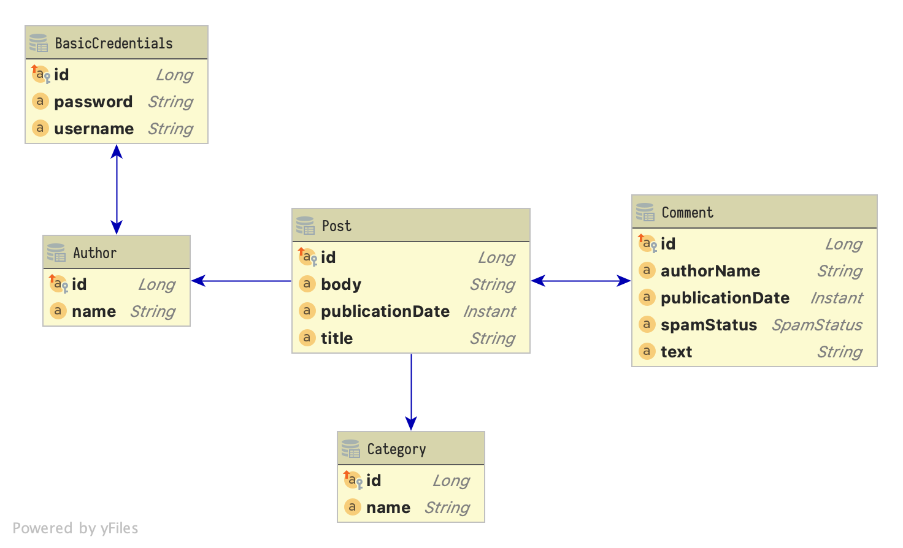

= Highly Efficient Enterprise Data Access
Matthias Andreas Benkard
// Meta
:experimental:
:data-uri:
:toc:
:stem:
:toclevels: 2
:description: Slides for my Hibernate Patterns and Antipatterns talk
:keywords: mulk
// Settings
:icons: font
:revealjs_theme: simple
:revealjs_width: 1280
:revealjs_height: 800
//:revealjs_width: 1920
//:revealjs_height: 1200
//:revealjs_customtheme: SLIDES.css
:customcss: SLIDES.css
//:source-highlighter: rouge
:source-highlighter: highlightjs
//:highlightjs-theme: https://cdn.jsdelivr.net/npm/reveal.js@3.9.2/lib/css/zenburn.css
//:highlightjs-theme: https://cdn.jsdelivr.net/npm/reveal.js@3.9.2/lib/css/monokai.css
//:highlightjs-theme: tomorrow.css
:highlightjs-theme: grayscale.css
:stem:

[%notitle]
== Setting the Stage

[%notitle]
[.columns]
=== Posts

[source,java,data-lines=]
[.column]
[.is-two-thirds]
----
@Entity
public class Post extends PanacheEntity {

  public String title;
  public Instant publicationDate;
  public String body;

  @ManyToOne(fetch = FetchType.LAZY)         //<1>
  public Author author;

  @ManyToMany(fetch = FetchType.LAZY)        //<2>
  public Collection<Category> categories;

  @OneToMany(fetch = FetchType.LAZY,
             mappedBy = "post")              //<3>
  public Collection<Comment> comments;
}
----

[.column]
<1> lazy is good (can always `JOIN FETCH` later)
<2> `@ManyToMany` always implies a join table
<3> mapping without a join table, non-owning side

[%notitle]
=== Comments and Categories

[source,java]
----
@Entity
public class Comment extends PanacheEntity {

  public String authorName;
  public Instant publicationDate;
  public String text;

  @Enumerated(EnumType.STRING)
  public SpamStatus spamStatus;

  @ManyToOne(fetch = FetchType.LAZY)
  public Post post;
}
----

[source,java]
----
@Entity
public class Category extends PanacheEntity {

  public String name;
}
----

[%notitle]
=== Authors, Login Credentials

[source,java]
----
@Entity
public class Author extends PanacheEntity {

  public String name;

  @OneToOne(fetch = FetchType.LAZY,        //<1>
            mappedBy = "author")
  @LazyToOne(LazyToOneOption.NO_PROXY)
  public BasicCredentials basicCredentials;
}
----

[source,java]
----
@Entity
public class BasicCredentials extends PanacheEntity {

  @OneToOne(fetch = FetchType.LAZY)
  @MapsId
  public Author author;

  public String username;
  public String password;
}
----

[%notitle]
//[.columns]
== Cartesian Blowup

[source,java]
----
@Transactional
public List<Post> getAllWithCommentsAndCategories() {

  return Post.find(
      """
      SELECT p FROM Post p
        LEFT JOIN FETCH p.comments
        LEFT JOIN FETCH p.categories
      """)
      .list();
}
----

[%notitle]
=== Bad SQL

[source,sql]
//[.column]
//[.is-two-thirds]
----
select
    post0_.id,
    comments1_.id,
    category3_.id,
    post0_.author_id,
    post0_.body,
    post0_.publication_date,
    post0_.title,
    comments1_.author_name,
    comments1_.post_id,
    comments1_.publication_date,
    comments1_.spam_status,
    comments1_.text,
    comments1_.post_id,
    comments1_.id,
    category3_.name,
    categories2_.post_id,
    categories2_.categories_id
from
    post post0_ 
left outer join
    comment comments1_ 
        on post0_.id=comments1_.post_id 
left outer join
    post_category categories2_ 
        on post0_.id=categories2_.post_id 
left outer join
    category category3_ 
        on categories2_.categories_id=category3_.id;
----

//[.column]
//[.is-one-third]

[%notitle]
=== Bad Results (1)

--
[source]
----
[2021-02-27 10:32:58] 60 rows retrieved
----

stem:[60 = ubrace|"posts"|_10 *
ubrace|("comments")/("post")|_3 * ubrace|"categories"|_2]

Cartesian explosion! 🙀

What gives?
--

[%notitle]
=== Bad Results (2)

[%header,format=tsv]
[.supersmall]
|===
post_id	com_id	cat_id	aut_id	body	pubdate	title	author_name	postid2	com_pubdate	spamp	com_text	postid3	com_id	cat_name	postid4	cat_id
4	16	44	1	""	2021-02-27 10:32:16.129627	Post #0	Anonymous Coward	4	2021-02-27 10:32:16.133969	UNKNOWN	First post	4	16	Category #1	4	44
4	15	44	1	""	2021-02-27 10:32:16.129627	Post #0	Anonymous Coward	4	2021-02-27 10:32:16.133963	UNKNOWN	First post	4	15	Category #1	4	44
4	14	44	1	""	2021-02-27 10:32:16.129627	Post #0	Anonymous Coward	4	2021-02-27 10:32:16.133870	UNKNOWN	First post	4	14	Category #1	4	44
4	16	45	1	""	2021-02-27 10:32:16.129627	Post #0	Anonymous Coward	4	2021-02-27 10:32:16.133969	UNKNOWN	First post	4	16	Category #0	4	45
4	15	45	1	""	2021-02-27 10:32:16.129627	Post #0	Anonymous Coward	4	2021-02-27 10:32:16.133963	UNKNOWN	First post	4	15	Category #0	4	45
4	14	45	1	""	2021-02-27 10:32:16.129627	Post #0	Anonymous Coward	4	2021-02-27 10:32:16.133870	UNKNOWN	First post	4	14	Category #0	4	45
5	19	44	2	""	2021-02-27 10:32:16.129674	Post #1	Anonymous Coward	5	2021-02-27 10:32:16.135200	UNKNOWN	First post	5	19	Category #1	5	44
5	18	44	2	""	2021-02-27 10:32:16.129674	Post #1	Anonymous Coward	5	2021-02-27 10:32:16.135192	UNKNOWN	First post	5	18	Category #1	5	44
5	17	44	2	""	2021-02-27 10:32:16.129674	Post #1	Anonymous Coward	5	2021-02-27 10:32:16.135205	UNKNOWN	First post	5	17	Category #1	5	44
5	19	45	2	""	2021-02-27 10:32:16.129674	Post #1	Anonymous Coward	5	2021-02-27 10:32:16.135200	UNKNOWN	First post	5	19	Category #0	5	45
5	18	45	2	""	2021-02-27 10:32:16.129674	Post #1	Anonymous Coward	5	2021-02-27 10:32:16.135192	UNKNOWN	First post	5	18	Category #0	5	45
5	17	45	2	""	2021-02-27 10:32:16.129674	Post #1	Anonymous Coward	5	2021-02-27 10:32:16.135205	UNKNOWN	First post	5	17	Category #0	5	45
6	22	44	3	""	2021-02-27 10:32:16.129700	Post #2	Anonymous Coward	6	2021-02-27 10:32:16.136043	UNKNOWN	First post	6	22	Category #1	6	44
6	21	44	3	""	2021-02-27 10:32:16.129700	Post #2	Anonymous Coward	6	2021-02-27 10:32:16.136038	UNKNOWN	First post	6	21	Category #1	6	44
6	20	44	3	""	2021-02-27 10:32:16.129700	Post #2	Anonymous Coward	6	2021-02-27 10:32:16.136031	UNKNOWN	First post	6	20	Category #1	6	44
6	22	45	3	""	2021-02-27 10:32:16.129700	Post #2	Anonymous Coward	6	2021-02-27 10:32:16.136043	UNKNOWN	First post	6	22	Category #0	6	45
6	21	45	3	""	2021-02-27 10:32:16.129700	Post #2	Anonymous Coward	6	2021-02-27 10:32:16.136038	UNKNOWN	First post	6	21	Category #0	6	45
6	20	45	3	""	2021-02-27 10:32:16.129700	Post #2	Anonymous Coward	6	2021-02-27 10:32:16.136031	UNKNOWN	First post	6	20	Category #0	6	45
7	25	44	1	""	2021-02-27 10:32:16.129724	Post #3	Anonymous Coward	7	2021-02-27 10:32:16.136904	UNKNOWN	First post	7	25	Category #1	7	44
7	24	44	1	""	2021-02-27 10:32:16.129724	Post #3	Anonymous Coward	7	2021-02-27 10:32:16.136897	UNKNOWN	First post	7	24	Category #1	7	44
7	23	44	1	""	2021-02-27 10:32:16.129724	Post #3	Anonymous Coward	7	2021-02-27 10:32:16.136909	UNKNOWN	First post	7	23	Category #1	7	44
7	25	45	1	""	2021-02-27 10:32:16.129724	Post #3	Anonymous Coward	7	2021-02-27 10:32:16.136904	UNKNOWN	First post	7	25	Category #0	7	45
7	24	45	1	""	2021-02-27 10:32:16.129724	Post #3	Anonymous Coward	7	2021-02-27 10:32:16.136897	UNKNOWN	First post	7	24	Category #0	7	45
7	23	45	1	""	2021-02-27 10:32:16.129724	Post #3	Anonymous Coward	7	2021-02-27 10:32:16.136909	UNKNOWN	First post	7	23	Category #0	7	45
8	28	44	2	""	2021-02-27 10:32:16.129746	Post #4	Anonymous Coward	8	2021-02-27 10:32:16.137743	UNKNOWN	First post	8	28	Category #1	8	44
8	27	44	2	""	2021-02-27 10:32:16.129746	Post #4	Anonymous Coward	8	2021-02-27 10:32:16.137739	UNKNOWN	First post	8	27	Category #1	8	44
8	26	44	2	""	2021-02-27 10:32:16.129746	Post #4	Anonymous Coward	8	2021-02-27 10:32:16.137731	UNKNOWN	First post	8	26	Category #1	8	44
8	28	45	2	""	2021-02-27 10:32:16.129746	Post #4	Anonymous Coward	8	2021-02-27 10:32:16.137743	UNKNOWN	First post	8	28	Category #0	8	45
8	27	45	2	""	2021-02-27 10:32:16.129746	Post #4	Anonymous Coward	8	2021-02-27 10:32:16.137739	UNKNOWN	First post	8	27	Category #0	8	45
8	26	45	2	""	2021-02-27 10:32:16.129746	Post #4	Anonymous Coward	8	2021-02-27 10:32:16.137731	UNKNOWN	First post	8	26	Category #0	8	45
9	31	44	3	""	2021-02-27 10:32:16.129767	Post #5	Anonymous Coward	9	2021-02-27 10:32:16.138536	UNKNOWN	First post	9	31	Category #1	9	44
9	30	44	3	""	2021-02-27 10:32:16.129767	Post #5	Anonymous Coward	9	2021-02-27 10:32:16.138548	UNKNOWN	First post	9	30	Category #1	9	44
9	29	44	3	""	2021-02-27 10:32:16.129767	Post #5	Anonymous Coward	9	2021-02-27 10:32:16.138543	UNKNOWN	First post	9	29	Category #1	9	44
9	31	45	3	""	2021-02-27 10:32:16.129767	Post #5	Anonymous Coward	9	2021-02-27 10:32:16.138536	UNKNOWN	First post	9	31	Category #0	9	45
9	30	45	3	""	2021-02-27 10:32:16.129767	Post #5	Anonymous Coward	9	2021-02-27 10:32:16.138548	UNKNOWN	First post	9	30	Category #0	9	45
9	29	45	3	""	2021-02-27 10:32:16.129767	Post #5	Anonymous Coward	9	2021-02-27 10:32:16.138543	UNKNOWN	First post	9	29	Category #0	9	45
10	34	44	1	""	2021-02-27 10:32:16.129789	Post #6	Anonymous Coward	10	2021-02-27 10:32:16.139349	UNKNOWN	First post	10	34	Category #1	10	44
10	33	44	1	""	2021-02-27 10:32:16.129789	Post #6	Anonymous Coward	10	2021-02-27 10:32:16.139354	UNKNOWN	First post	10	33	Category #1	10	44
10	32	44	1	""	2021-02-27 10:32:16.129789	Post #6	Anonymous Coward	10	2021-02-27 10:32:16.139337	UNKNOWN	First post	10	32	Category #1	10	44
10	34	45	1	""	2021-02-27 10:32:16.129789	Post #6	Anonymous Coward	10	2021-02-27 10:32:16.139349	UNKNOWN	First post	10	34	Category #0	10	45
10	33	45	1	""	2021-02-27 10:32:16.129789	Post #6	Anonymous Coward	10	2021-02-27 10:32:16.139354	UNKNOWN	First post	10	33	Category #0	10	45
10	32	45	1	""	2021-02-27 10:32:16.129789	Post #6	Anonymous Coward	10	2021-02-27 10:32:16.139337	UNKNOWN	First post	10	32	Category #0	10	45
11	37	44	2	""	2021-02-27 10:32:16.129809	Post #7	Anonymous Coward	11	2021-02-27 10:32:16.140032	UNKNOWN	First post	11	37	Category #1	11	44
11	36	44	2	""	2021-02-27 10:32:16.129809	Post #7	Anonymous Coward	11	2021-02-27 10:32:16.140025	UNKNOWN	First post	11	36	Category #1	11	44
11	35	44	2	""	2021-02-27 10:32:16.129809	Post #7	Anonymous Coward	11	2021-02-27 10:32:16.140037	UNKNOWN	First post	11	35	Category #1	11	44
11	37	45	2	""	2021-02-27 10:32:16.129809	Post #7	Anonymous Coward	11	2021-02-27 10:32:16.140032	UNKNOWN	First post	11	37	Category #0	11	45
11	36	45	2	""	2021-02-27 10:32:16.129809	Post #7	Anonymous Coward	11	2021-02-27 10:32:16.140025	UNKNOWN	First post	11	36	Category #0	11	45
11	35	45	2	""	2021-02-27 10:32:16.129809	Post #7	Anonymous Coward	11	2021-02-27 10:32:16.140037	UNKNOWN	First post	11	35	Category #0	11	45
12	40	44	3	""	2021-02-27 10:32:16.129839	Post #8	Anonymous Coward	12	2021-02-27 10:32:16.140766	UNKNOWN	First post	12	40	Category #1	12	44
12	39	44	3	""	2021-02-27 10:32:16.129839	Post #8	Anonymous Coward	12	2021-02-27 10:32:16.140786	UNKNOWN	First post	12	39	Category #1	12	44
12	38	44	3	""	2021-02-27 10:32:16.129839	Post #8	Anonymous Coward	12	2021-02-27 10:32:16.140779	UNKNOWN	First post	12	38	Category #1	12	44
12	40	45	3	""	2021-02-27 10:32:16.129839	Post #8	Anonymous Coward	12	2021-02-27 10:32:16.140766	UNKNOWN	First post	12	40	Category #0	12	45
12	39	45	3	""	2021-02-27 10:32:16.129839	Post #8	Anonymous Coward	12	2021-02-27 10:32:16.140786	UNKNOWN	First post	12	39	Category #0	12	45
12	38	45	3	""	2021-02-27 10:32:16.129839	Post #8	Anonymous Coward	12	2021-02-27 10:32:16.140779	UNKNOWN	First post	12	38	Category #0	12	45
13	43	44	1	""	2021-02-27 10:32:16.129860	Post #9	Anonymous Coward	13	2021-02-27 10:32:16.141651	UNKNOWN	First post	13	43	Category #1	13	44
13	42	44	1	""	2021-02-27 10:32:16.129860	Post #9	Anonymous Coward	13	2021-02-27 10:32:16.141655	UNKNOWN	First post	13	42	Category #1	13	44
13	41	44	1	""	2021-02-27 10:32:16.129860	Post #9	Anonymous Coward	13	2021-02-27 10:32:16.141642	UNKNOWN	First post	13	41	Category #1	13	44
13	43	45	1	""	2021-02-27 10:32:16.129860	Post #9	Anonymous Coward	13	2021-02-27 10:32:16.141651	UNKNOWN	First post	13	43	Category #0	13	45
13	42	45	1	""	2021-02-27 10:32:16.129860	Post #9	Anonymous Coward	13	2021-02-27 10:32:16.141655	UNKNOWN	First post	13	42	Category #0	13	45
13	41	45	1	""	2021-02-27 10:32:16.129860	Post #9	Anonymous Coward	13	2021-02-27 10:32:16.141642	UNKNOWN	First post	13	41	Category #0	13	45
|===

[%notitle]
=== Fix: Sequential Fetch Queries

[source,java]
----
@Transactional
public List<Post> getAllWithCommentsAndCategories2() {

  List<Post> posts = Post.find(
      """
      SELECT p FROM Post p
        LEFT JOIN FETCH p.comments
      """)
      .list();

  posts = Post.find(
      """
      SELECT DISTINCT p FROM Post p
        LEFT JOIN FETCH p.categories
       WHERE p IN (?1)
      """,
      posts)
      .list();

  return posts;
}
----

[%notitle]
[.columns]
=== Good SQL

[source,sql]
[.column]
----
select
    post0_.id,
    comments1_.id,
    post0_.author_id,
    post0_.body,
    post0_.publication_date,
    post0_.title,
    comments1_.author_name,
    comments1_.post_id,
    comments1_.publication_date,
    comments1_.spam_status,
    comments1_.text,
    comments1_.post_id,
    comments1_.id
from
    post post0_
left outer join
    comment comments1_
        on post0_.id=comments1_.post_id
----

[source,sql]
[.column]
----
select
    distinct post0_.id,
    cat2_.id,
    post0_.author_id,
    post0_.body,
    post0_.publication_date,
    post0_.title,
    cat2_.name,
    cats1_.post_id,
    cats1_.categories_id
from
    post post0_
left outer join
    post_category cats1_
        on post0_.id=cats1_.post_id
left outer join
    category cat2_
        on cats1_.categories_id=cat2_.id
where
    post0_.id in (
        ? , ? , ? , ? , ? , ? , ? , ? ,
        ? , ? , ? , ? , ? , ? , ? , ? ,
        ? , ? , ? , ? , ? , ? , ? , ? ,
        ? , ? , ? , ? , ? , ?
    )
----

[%notitle]
== Update without `#persist`

[source,java]
----
@Transactional
public void resetCommentStatus() {

  List<Comment> comments = Comment.find(
      """
      SELECT c FROM Comment c
       WHERE c.spamStatus <> 'UNKNOWN'
      """)
      .list();

  comments.forEach(c -> c.spamStatus = SpamStatus.UNKNOWN);
}
----

[%notitle]
=== Good SQL

[source,sql]
----
select
    comment0_.id,
    comment0_.author_name,
    comment0_.post_id,
    comment0_.publication_date,
    comment0_.spam_status,
    comment0_.text
from
    comment comment0_
where
    comment0_.spam_status<>'UNKNOWN'
----

[source,sql]
----
update
    comment
set
    author_name=?,
    post_id=?,
    publication_date=?,
    spam_status=?,
    text=?
where
    id=?

update
...
----

[%notitle]
== First-Level Caching for the Win

[source,java]
----
@Transactional
public void updateCommentStatus() {

  List<Comment> comments = Comment.find(                      //<1>
      """
      SELECT c FROM Comment c
       WHERE c.spamStatus = 'UNKNOWN'
      """)
      .list();

  var assessments = spamAssessmentService.assess(comments);   //<2>

  for (var assessment : assessments.entrySet()) {
    Comment comment = Comment.findById(assessment.getKey());  //<3>
    comment.spamStatus = assessment.getValue();
  }
}
----

[%notitle]
=== Good SQL

[source,sql]
----
select
    comment0_.id,
    comment0_.author_name,
    comment0_.post_id,
    comment0_.publication_date,
    comment0_.spam_status,
    comment0_.text
from
    comment comment0_
where
    comment0_.spam_status='UNKNOWN'
----

[source,sql]
----
update
    comment
set
    author_name=?,
    post_id=?,
    publication_date=?,
    spam_status=?,
    text=?
where
    id=?

update
...
----

[%notitle]
== `@OneToOne` Surprises

[source,java]
----
@Transactional
public List<Post> getAllWithAuthors() {

  return Post.find(
      """
      SELECT p FROM Post p
        LEFT JOIN FETCH p.author
      """)
      .list();
}
----

[%notitle]
[.columns]
=== Bad SQL

[source,sql]
[.column]
----
select
    post0_.id,
    author1_.id,
    post0_.author_id,
    post0_.body,
    post0_.publication_date,
    post0_.title,
    author1_.name
from
    post post0_
left outer join
    author author1_
        on post0_.author_id=author1_.id

select
    basiccrede0_.author_id,
    basiccrede0_.password,
    basiccrede0_.username
from
    basic_credentials basiccrede0_
where
    basiccrede0_.author_id=?
----

[source,sql]
[.column]
----
select
    basiccrede0_.author_id,
    basiccrede0_.password,
    basiccrede0_.username
from
    basic_credentials basiccrede0_
where
    basiccrede0_.author_id=?

select
    basiccrede0_.author_id,
    basiccrede0_.password,
    basiccrede0_.username
from
    basic_credentials basiccrede0_
where
    basiccrede0_.author_id=?
----

[%notitle]
=== Another Look at the Author

[source,java]
----
@Entity
public class Author extends PanacheEntity {

  public String name;

  @OneToOne(fetch = FetchType.LAZY,
            mappedBy = "author")
  public BasicCredentials basicCredentials;  //<1>
}
----

[source,java]
----
@Entity
public class BasicCredentials extends PanacheEntity {

  @OneToOne(fetch = FetchType.LAZY)
  @MapsId
  public Author author;                      //<2>

  public String username;
  public String password;
}
----

=== Why?

Hibernate has no way of knowing whether `Author#basicCredentials` is `null`!

[%notitle]
[.columns]
=== Fix: `@LazyToOne(NO_PROXY)`

[source,java,data-line-numbers=8]
[.column]
[.is-two-thirds]
----
@Entity
public class Author extends PanacheEntity {

  public String name;

  @OneToOne(fetch = FetchType.LAZY,
            mappedBy = "author")
  @LazyToOne(LazyToOneOption.NO_PROXY)  //<1>
  public BasicCredentials basicCredentials;
}
----

[.column]
<1> `NO_PROXY` + bytecode enhancement = profit

[%notitle]
=== Good SQL

[source,sql]
----
select
    post0_.id,
    author1_.id,
    post0_.author_id,
    post0_.body,
    post0_.publication_date,
    post0_.title,
    author1_.name
from
    post post0_
left outer join
    author author1_
        on post0_.author_id=author1_.id
----

[%notitle]
== Projection Queries

[source,java]
----
@Transactional
public List<PostSummary> overview() {

  return entityManager.createQuery(
      """
      SELECT NEW eu.mulk.demos.blog.posts.PostSummary(
          p.author.name, p.title, p.publicationDate, size(p.comments))
        FROM Post p
      """,
      PostSummary.class)
      .getResultList();
}
----

[%notitle]
=== Projection DTOs

[source,java]
----
public final class PostSummary {

  public final String authorName;
  public final String title;
  public final Instant publicationDate;
  public final int commentCount;

  public PostSummary(                        //<1>
      String authorName,
      String title,
      Instant publicationDate,
      int commentCount) {
    this.authorName = authorName;
    this.title = title;
    this.publicationDate = publicationDate;
    this.commentCount = commentCount;
  }
}
----

[%notitle]
=== Good SQL

[source,sql]
----
select
    author1_.name,
    post0_.title,
    post0_.publication_date,
    (select
        count(comments2_.post_id)
     from
        comment comments2_
     where
        post0_.id = comments2_.post_id)
from
    post post0_
cross join
    author author1_
where
    post0_.author_id=author1_.id
----

[%notitle]
== Conclusion

- Lazy is good
- Lazier is better
- Lazy with bytecode enhancement is best
- Sequential queries avoid cartesian blowup
- The 1st-level cache is your friend
- Use DTO projections everywhere all the time
